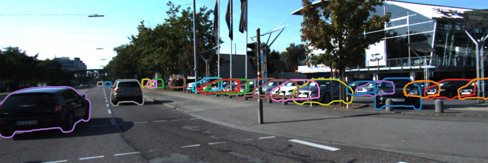
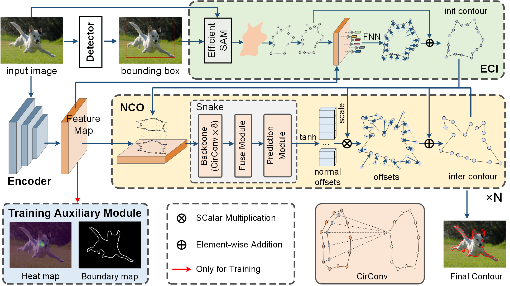

# SAMSnake: A Generic Contour-based Instance Segmentation Network Assisted by Efficient Segment Anything Model



## Installation

Please see [INSTALL.md](INSTALL.md).

## Architecture


## Testing

### Testing on COCO

1. Download the pretrained model [here].

2. Prepared the COCO dataset according to the [INSTALL.md](INSTALL.md).

3. Test:

   ```
   # testing segmentation accuracy on coco val set
   python test.py coco --checkpoint /path/to/model_coco.pth --with_nms True

   # testing the speed
   python test.py coco --checkpoint /path/to/model_coco.pth --with_nms True --type speed

   # testing on coco test-dev set, run and submit data/result/results.json
   python test.py coco --checkpoint /path/to/model_coco.pth --with_nms True --dataset coco_test
   ```

### Testing on SBD

1. Download the pretrained model [here].

2. Prepared the SBD dataset according to the [INSTALL.md](INSTALL.md).

3. Test:

   ```
   # testing segmentation accuracy on SBD
   python test.py sbd --checkpoint /path/to/model_sbd.pth

   # testing the speed
   python test.py sbd --checkpoint /path/to/model_sbd.pth --type speed
   ```

### Testing on KINS

1. Download the pretrained model [here].

2. Prepared the KINS dataset according to the [INSTALL.md](INSTALL.md).

3. Test:

   Maybe you will find some troules, such as `object of type <class 'numpy.float64'> cannot be safely interpreted as an integer`. Please modify the  `/path/to/site-packages/pycocotools/cooceval.py`. Replace `np.round((0.95 - .5) / .05) ` in lines 506 and 507 with `int(np.round((0.95 - .5) / .05))`.

   ```
   # testing segmentation accuracy on KINS
   python test.py kitti --checkpoint /path/to/model_kitti.pth

   # testing the speed
   python test.py kitti --checkpoint /path/to/model_kitti.pth --type speed
   ```

### Testing on Cityscapes 

1. Download the pretrained model [here].

2. Prepared the KINS dataset according to the [INSTALL.md](INSTALL.md).

3. Test:

   We will soon release the code for e2ec with multi component detection. Currently only supported for testing e2ec performance on cityscapes dataset.

   ```
   # testing segmentation accuracy on Cityscapes with coco evaluator
   python test.py cityscapesCoco --checkpoint /path/to/model_cityscapes.pth

   # with cityscapes official evaluator
   python test.py cityscapes --checkpoint /path/to/model_cityscapes.pth

   # testing the speed
   python test.py cityscapesCoco \
   --checkpoint /path/to/model_cityscapes.pth --type speed

   # testing on test set, run and submit the result file
   python test.py cityscapes --checkpoint /path/to/model_cityscapes.pth \
   --dataset cityscapes_test
   ```

## Visualization

1. Download the [pretrained model].

2. Visualize:

   ```
   # inference and visualize the images with coco pretrained model
   python visualize.py coco /path/to/images \
   --checkpoint /path/to/model_coco.pth --with_nms True

   # you can using other pretrained model, such as cityscapes 
   python visualize.py cityscapesCoco /path/to/images \
   --checkpoint /path/to/model_cityscapes.pth

   # if you want to save the visualisation, please specify --output_dir
   python visualize.py coco /path/to/images \
   --checkpoint /path/to/model_coco.pth --with_nms True \
   --output_dir /path/to/output_dir

   # visualize the results at different stage
   python visualize.py coco /path/to/images \
   --checkpoint /path/to/model_coco.pth --with_nms True --stage coarse

   # you can reset the score threshold, default is 0.3
   python visualize.py coco /path/to/images \
   --checkpoint /path/to/model_coco.pth --with_nms True --ct_score 0.1

   # if you want to filter some of the jaggedness caused by dml 
   # please using post_process
   python visualize.py coco /path/to/images \
   --checkpoint /path/to/model_coco.pth --with_nms True \
   --with_post_process True
   ```

## Training

We have released the code for multi GPU training with ddp.

### Training with multi GPUS

```
CUDA_VISIBLE_DEVICES=${gpu_ids} python -m torch.distributed.launch \
--nproc_per_node ${gpu_nums} \
train_net_ddp.py \
--config_file ${dataset} \
--bs ${bs_per_gpu} \
--gpus ${gpu_nums}
# the example of training sbd dataset using 2 gpus
CUDA_VISIBLE_DEVICES=0,1 python -m torch.distributed.launch \
--nproc_per_node 2 \
train_net_ddp.py \
--config_file sbd \
--bs 12 \
--gpus 2
```

### Training on SBD

```
python train_net.py sbd --bs $batch_size
# if you do not want to use dinamic matching loss (significantly improves 
# contour detail but introduces jaggedness), please set --dml as False
python train_net.py sbd --bs $batch_size --dml False
```

### Training on KINS

```
python train_net.py kitti --bs $batch_size
```

### Training on Cityscapes

```
python train_net.py cityscapesCoco --bs $batch_size
```

### Training on COCO

In fact it is possible to achieve the same accuracy without training so many epochs.

```
# first to train with adam
python train_net.py coco --bs $batch_size
# then finetune with sgd
python train_net.py coco_finetune --bs $batch_size \
--type finetune --checkpoint data/model/139.pth
```

### Training on the other dataset

If the annotations is in coco style:

1. Add dataset information to `dataset/info.py`.

2. Modify the `configs/coco.py`, reset the `train.dataset` , `model.heads['ct_hm']` and `test.dataset`. Maybe you also need to change the `train.epochs`, `train.optimizer['milestones']` and so on.

3. Train the network.

   ```
   python train_net.py coco --bs $batch_size
   ```

If  the annotations is not in coco style:

1. Prepare `dataset/train/your_dataset.py` and `dataset/test/your_dataset.py` by referring to `dataset/train/base.py` and `dataset/test/base.py`.

2. Prepare `evaluator/your_dataset/snake.py` by referring to `evaluator/coco/snake.py`.

3. Prepare `configs/your_dataset.py` and by referring to `configs/base.py`.

4. Train the network.

   ```
   python train_net.py your_dataset --bs $batch_size
   ```

## Acknowledgement

Code is largely based on [E2EC](https://github.com/zhang-tao-whu/e2ec). Thanks for their wonderful works.
